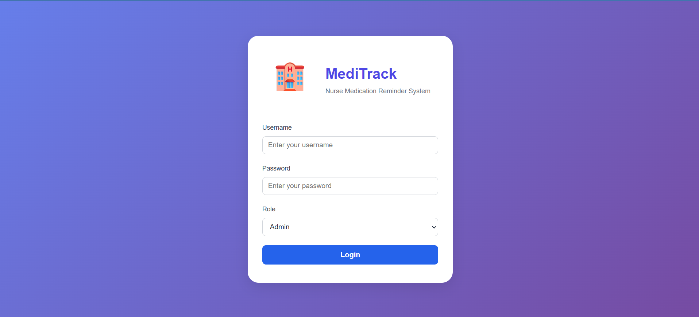
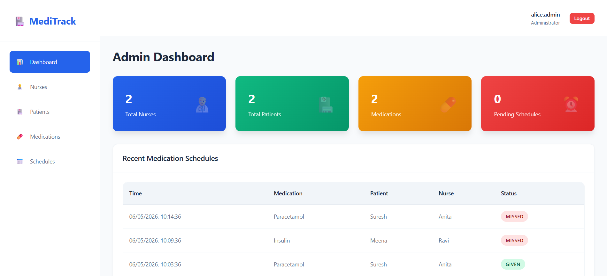
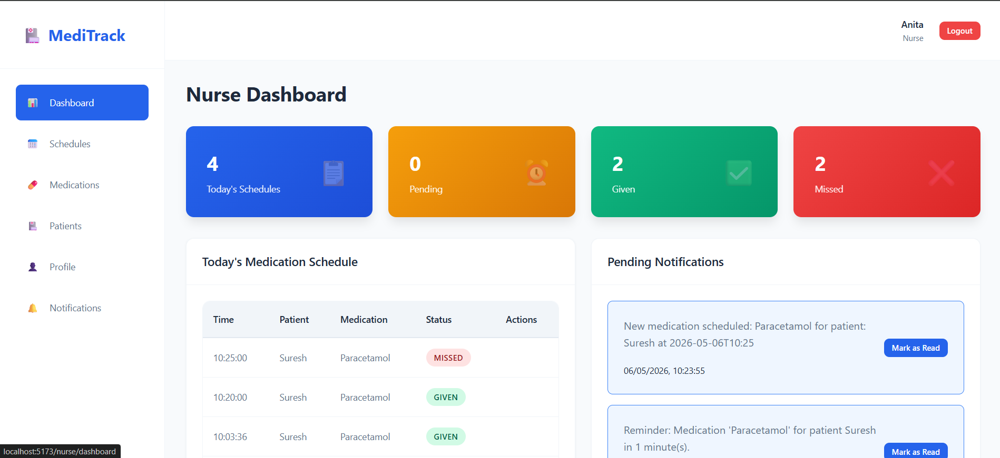

# MediTrack - Nurse Medication Reminder System

A comprehensive medication management system for healthcare facilities with separate Admin and Nurse interfaces.

## 📁 Project Structure

```
meditrack/
├── meditrack-backend/          # Spring Boot Backend
│   ├── src/
│   ├── pom.xml
│   ├── mvnw, mvnw.cmd
│   └── .mvn/
├── meditrack-frontend/         # React + Vite Frontend
│   ├── src/
│   ├── package.json
│   └── vite.config.js
└── MediTrack_API_Collection.postman_collection.json
```

## 🚀 Quick Start

### Backend (Spring Boot)
```bash
cd meditrack-backend
mvn spring-boot:run
```
Backend runs on: **http://localhost:8080**

### Frontend (React + Vite)
```bash
cd meditrack-frontend
npm install
npm run dev
```
Frontend runs on: **http://localhost:5173**

## 🔐 Default Credentials

### Admin Login
- **Username:** `alice.admin`
- **Password:** `admin@123`
- **Role:** ADMIN

### Nurse Login
- **Username:** `EMP001`
- **Password:** `anita@123`
- **Role:** NURSE

## 📋 Features

### Admin Features
- Dashboard with statistics
- Manage nurses (assign to floors)
- Manage patients (assign to floors, view medications)
- Manage medications (add to patients)
- Manage medication schedules (create, update, delete)

### Nurse Features
- Dashboard with today's statistics
- View and manage medication schedules (mark as given/missed)
- View patients in assigned floor
- View patient medications
- Update profile
- View and manage notifications

## 🛠️ Technology Stack

### Backend
- Java 17
- Spring Boot 3.x
- Spring Data JPA
- H2 Database (in-memory)
- Spring Security
- BCrypt Password Encoding

### Frontend
- React 19.2.0
- Vite 7.3.1
- React Router DOM 7.13.0
- Axios 1.13.5
- Modern CSS Design System

## 🎨 UI Features

- Modern, responsive design
- Toast notifications
- Loading states
- Form validation
- Modal dialogs
- Tab navigation
- Status badges
- Empty states
- Smooth animations

## 🔄 Database Schema

- **Users** - Admin accounts
- **Nurses** - Nurse accounts with floor assignments
- **Patients** - Patient records with floor and nurse assignments
- **Medications** - Medication records for patients
- **MedicationSchedules** - Scheduled medication times
- **Notifications** - Nurse notifications
- **Floors** - Hospital floor/ward information

## 🧰 Tech Stack

| Technology       | Purpose                      |
|------------------|------------------------------|
| **React.js**     | Frontend UI Framework        |
| **Spring Boot**      | Backend Runtime Environment  |
| **SQL**      | Database               |
| **JWT**          | Secure User Authentication   |
| **React Toastify** | In-app Notifications      |

## 📱 Screenshots

### Login Page


### Admin Dashboard


### Nurse Dashboard

